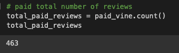
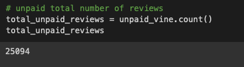
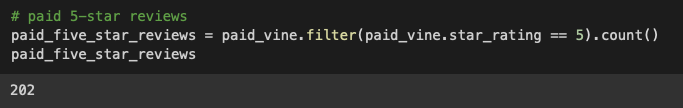
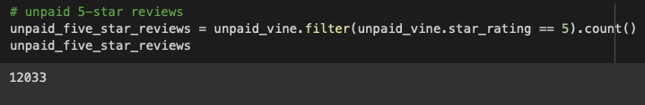
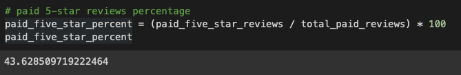
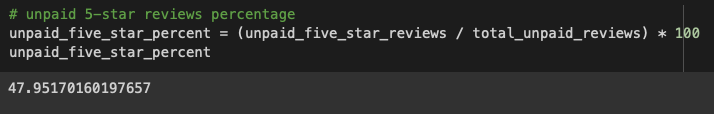

# Amazon_Vine_Analysis

## Analysis Overview

This project analyzes Amazon Vine program and determines if there is a bias toward favorable reviews from Vine members.

The analysis uses PySpark to perform the ETL process to extract the dataset, transform the data, connect to an AWS RDS instance and load the transformed data into pgAdmin and calculate different metrics.

[We focused on the US reviews for Baby](https://s3.amazonaws.com/amazon-reviews-pds/tsv/amazon_reviews_us_Baby_v1_00.tsv.gz)

## Resources

- Data Source 

[Amazon Review datasets](https://s3.amazonaws.com/amazon-reviews-pds/tsv/index.txt), 

[Baby Review dataset](https://s3.amazonaws.com/amazon-reviews-pds/tsv/amazon_reviews_us_Baby_v1_00.tsv.gz)

- Tools: Google Colab Notebook, JDBC:postgresql-42.2.16.jar, pgAdmin 4, AWS PG11.15

## Results

### Total Reviews

- Paid Reviews

     

 

- UnPaid Reviews

     

 

### Total Review With 5-Star

- Paid Reviews with 5-Star

     

 

- Un-Paid Reviews with 5-Star

     

 

### Percentage of 5-star reviews

- Paid Reviews

     

 

- Un-Paid Reviews

     

 

## Summary
43% of the reviews in the Vine program were 5 stars reviews whereas the percentage in the non-Vine reviews is 48% .

This describes less positivity bias for reviews in the Vine program and we had more rieview in non-Vine which gives more accuriate data, which concludes Vine program didn't reflect actual guests.
